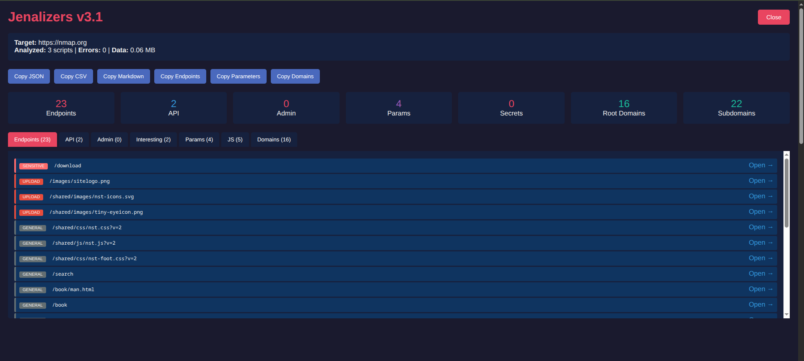

# Jenalizers v3.1

Advanced JavaScript-based reconnaissance tool for bug bounty hunters and security researchers.



## Features

- **Endpoint Discovery** - Extracts paths, API routes, admin panels, and interesting endpoints
- **Domain Enumeration** - Finds subdomains and external domains with TLD validation
- **Secret Detection** - Identifies API keys, tokens, credentials with severity levels
- **Parameter Mining** - Extracts URL parameters for fuzzing
- **JS File Analysis** - Fetches and analyzes external JavaScript files
- **Multiple Export Formats** - JSON, CSV, Markdown, and plain text
- **Interactive UI** - Tabbed interface with copy-to-clipboard functionality

## What It Detects

| Category | Examples |
|----------|----------|
| **Secrets** | AWS Keys, Google API Keys, GitHub Tokens, JWTs, Private Keys, Stripe Keys, Slack Tokens |
| **Endpoints** | API routes, Admin paths, Auth endpoints, Upload paths, GraphQL endpoints |
| **Domains** | Subdomains, Third-party services, CDN URLs, API hosts |
| **Parameters** | Query parameters, Form fields, Hidden inputs |

## Installation

### Option 1: DevTools Snippet (Recommended)

1. Open Chrome DevTools (`F12`)
2. Go to **Sources** > **Snippets**
3. Click **+ New snippet**
4. Paste the contents of `jenalizers.js`
5. Save and run with `Ctrl+Enter`

### Option 2: Bookmarklet

Create a bookmark with this URL:
```javascript
javascript:(function(){var s=document.createElement('script');s.src='https://raw.githubusercontent.com/Cy-S3c/Jenalizers/main/jenalizers.js';document.body.appendChild(s);})();
```

### Option 3: Console

Copy and paste the entire script into browser console.

## Usage

1. Navigate to your target website
2. Run the script using your preferred method
3. Wait for analysis to complete (processes all JS files)
4. Use the interactive UI to explore findings
5. Export results in your preferred format

## Output

The tool provides:

- **Summary Stats** - Total counts for each category
- **Secrets Panel** - Color-coded by severity (Critical, High, Medium, Low)
- **Tabbed Results** - Endpoints, API, Admin, Interesting, Params, JS Files, Domains
- **Export Buttons** - JSON, CSV, Markdown, Endpoints list, Parameters list, Domains list

## Example Output (JSON)

```json
{
  "meta": {
    "tool": "Jenalizers v3.1",
    "target": "https://example.com",
    "stats": {
      "totalEndpoints": 156,
      "apiEndpoints": 23,
      "adminPaths": 5,
      "secrets": 2,
      "uniqueDomains": 12
    }
  },
  "findings": {
    "secrets": [...],
    "adminPaths": ["/admin", "/dashboard"],
    "interestingPaths": ["/upload", "/export"]
  },
  "endpoints": {
    "api": ["/api/v1/users", "/api/v1/auth"],
    "byCategory": {...}
  }
}
```

## Changelog

### v3.1
- Fixed domain enumeration (was matching JS object paths like `window.NREUM`)
- Fixed endpoint extraction (was capturing numeric literals like `10`, `11`)
- Added TLD validation for domains
- Added comprehensive JS pattern exclusion
- Added minified variable pattern filtering

### v3.0
- Added subdomain grouping by root domain
- Improved secret detection with context and severity levels
- Added path normalization
- Added interesting endpoints highlighting
- Multiple export formats

## Legal Disclaimer

This tool is intended for **authorized security testing only**. Always ensure you have explicit permission before testing any target. The author is not responsible for any misuse of this tool.

## Author

**Cy-S3c** (0xV0RT3X)

## License

MIT License - See [LICENSE](LICENSE) file for details.
